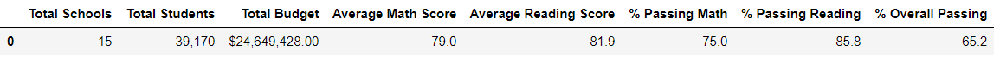
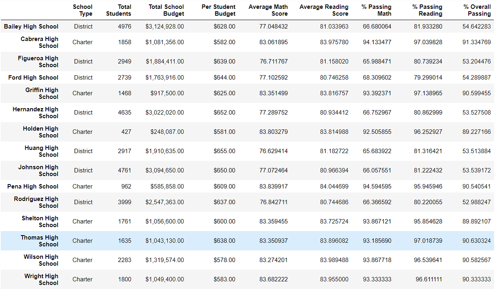
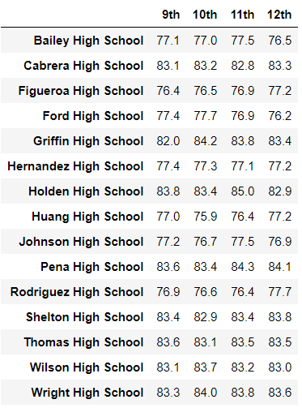
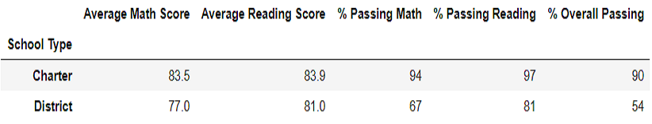

# School District Analysis
## Overview of the school district analysis
In this project, we were using Pandas and Jupyter Notebook to analyze school budget data and students’ score data. Our results evaluated the schools’ performance and helped the management board to balance the future funding budget among each school. An original script was developed based on the initial data. However, we were told later that math and reading grades for Thomas High School ninth graders had been altered. In the challenge, we replaced the math and reading grades with NaNs for Thomas High School ninth graders and redid the school performance analysis again.

## Resources
-	Data Source: schools_complete.csv, students_complete.csv (in the Resources folder)
-	Software: Python 3.7.6

## Results
### The district summary result
The table 1 and table 2 show the original school district summary and the summary after data modified.
-	There were 15 schools, 39,170 students, and $24,649,428.00 budget in total.
-	Average math score, average reading score, passing math percentage, passing reading percent almost remained the same (round to the integer). The overall passing percentage were lower 0.3% after modification.

Table 1 The district summary

Table 2 The district summary after data modification

### The school summary result
-	The results for other 14 schools except Thomas High School remained the same.
-	Table 3 showed each school’s summary after we replaced the math and reading grades with NaNs for Thomas High School ninth graders. The average math score, average reading score, passing math percentage, passing reading percentage and overall passing percentage were quite low for Thomas High School. This was because that we didn’t exclude the ninth graders in our students’ counting. To correct this, we used the number of 10th-12th graders from Thomas High School to redo the calculation. Table 4 showed the correct performance description for Thomas High School.

Table 3 The school summary

Table 4 The school summary after data modification

### Average math scores each grade
-	There was no change for other schools’ results (Table 5 & 6).
-	The average scores for 10th-12th graders in Thomas High School remained the same. The average math score for 9th grader changed from 83.6 to not available as the data was replaced by NaN.

Table 5 Average math scores each grade

Table 6 Average math scores each grade after data modification

### Average reading scores each grade
-	There was no change for other schools’ results (Table 7 & 8).
-	The average scores for 10th-12th graders in Thomas High School remained the same. The average reading score for 9th grader changed from 83.7 to not available as the data was replaced by NaN.

Table 7 Average reading scores each grade

Table 8 Average reading scores each grade after data modification

### Top & Bottom 5 schools based on overall passing percentage
Although the overall passing percentage for Thomas High School had been changed from 90.95% to 90.63% after we replaced the ninth graders’ math and reading scores, there was no change for Top and Bottom 5 schools in our result. Table 9 showed the top 5 schools and table 10 should the bottom 5 schools.

Table 9 The top 5 schools

Table 10 The bottom 5 schools

### Results of spending ranges
Our schools had been separated into 4 ranges based on their budget spending for each student. The result (Table 11) remained the same after we replaced the data.

Table 11 Results of spending ranges

### Results of school size
In the project, we divided 15 schools to 3 school sizes based on their students. The result (Table 12) remained the same after we replaced the data.

Table 12 Results of school size

### Results of school type
In the project, we performed school performance by school type. The result (Table 13) also remained the same after we replaced the data.

Table 13 Results of school type

## Summary
There were changes to the school district analysis after we changed the math and reading scores for Thomas High Schools ninth graders. The math passing percentage, reading passing percentage, and overall passing percentage had been changed after modification. Our original percentage calculation script was no longer useful for Thomas High School since the sample student number had been changed. To correct this, we used only 10th-12th graders to calculate these three percentages for Thomas High School. The analysis for 9th graders in Thomas High School was no longer available after we replaced the data.
